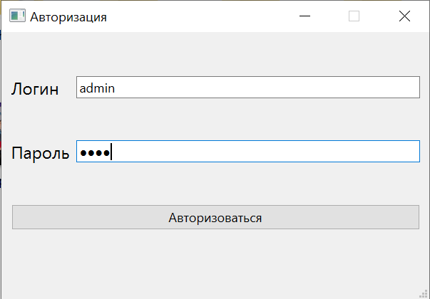
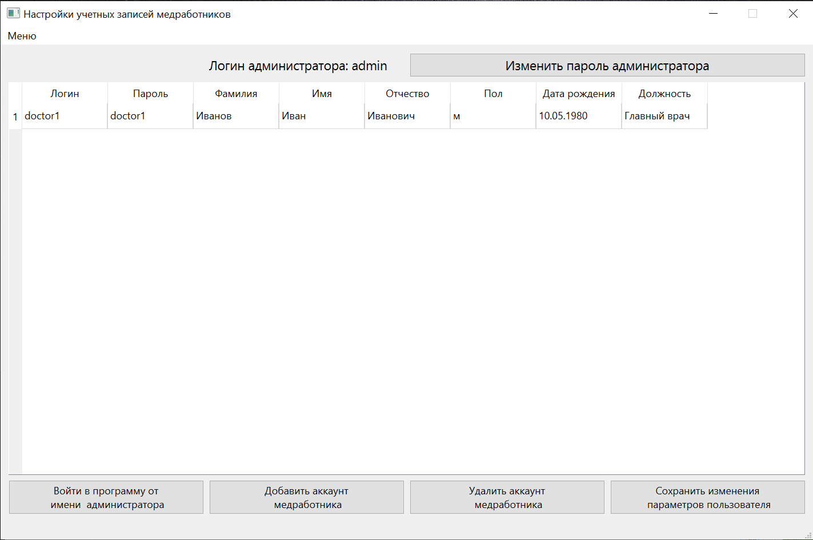
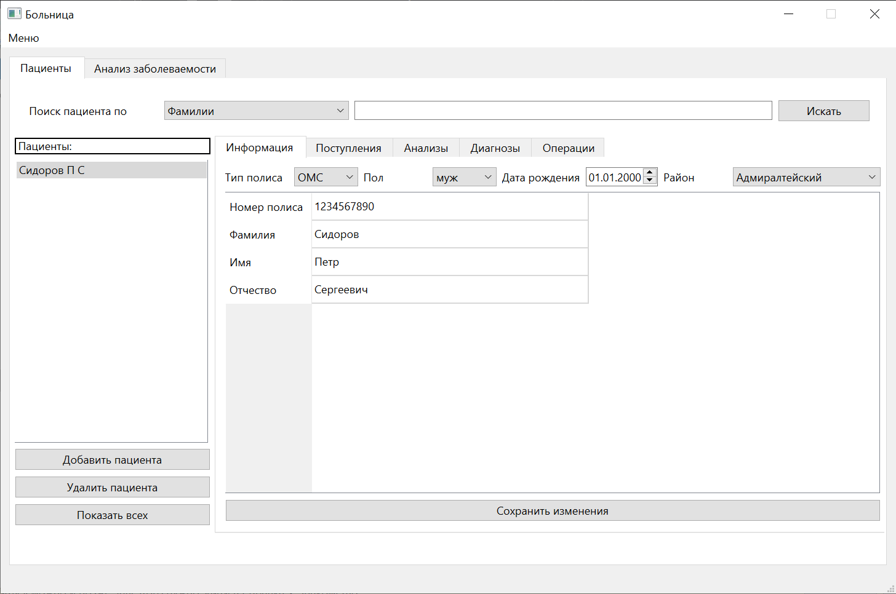
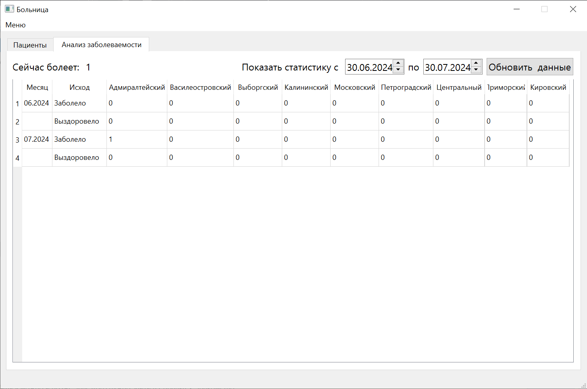

# Course-project-hospital
Educational course project on object-oriented programming  
Written in Qt6  
This is an app for keeping records in a hospital.

Default credentials:  
```
login admin
password 0000
```
The administrator can change the password, create doctor accounts, delete and leave any records.  
Doctors can decide to delete only their own records.  
Doctors can attract patients, order various assessments  
It is possible to view incidence statistics by month/region  

## Screenshots
Auth  


Registration  


Main page  


Statistics
